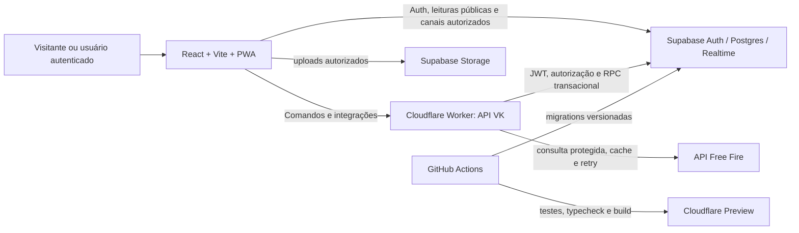

# Arquitetura de Referência — VK ORGANIZAÇÃO

**Status:** EM DESENVOLVIMENTO  
**Versão:** 0.1.0  
**Fonte normativa:** [Especificação-mãe](./PRODUCT_SPEC.md) e [contrato da API Free Fire](./API_FREEFIRE.md).

> Esta arquitetura descreve o alvo de produção. O ambiente de desenvolvimento atual é apenas a área de construção; nenhuma publicação foi realizada. A implementação não deverá ser considerada aprovada até que as migrations, políticas RLS, fluxos reais, contas de teste, testes de interface, testes de Realtime e validação em preview estejam concluídos.

## 1. Decisões arquiteturais

O VK ORGANIZAÇÃO será uma aplicação web **multi-tenant por guilda**. O domínio público, a comunidade social e os módulos de gestão partilham a mesma identidade de usuário, mas seus dados são segregados por contexto e autorização. A plataforma adotará **React, TypeScript estrito e Vite** no cliente; **Cloudflare Workers** como gateway de API e borda; e **Supabase** para Auth, PostgreSQL, Storage e Realtime. O uso de Workers com uma SPA React/Vite e um backend de API é compatível com a orientação oficial da Cloudflare para esse modelo [4].

| Camada | Responsabilidade | Regra de segurança |
|---|---|---|
| Cliente React | Interface pública, área autenticada, cache de consultas, formulários, acessibilidade e PWA | Nunca contém secrets, chave de serviço ou autorização decisiva. |
| Supabase Auth | Cadastro, e-mail, senha, sessão, renovação e recuperação | O `user_id` canônico é `auth.users.id`; não se misturam sessão e perfil. |
| PostgreSQL/Supabase | Fonte de verdade, integridade, RLS, funções transacionais, índices e auditoria | Toda tabela exposta terá RLS e grants mínimos. |
| Cloudflare Worker | Gateway VK, comandos de negócio, validações, rate limit, Turnstile, API Free Fire e observabilidade | Valida o JWT, autoriza por guilda e nunca devolve secrets. |
| Supabase Storage | Avatares, capas, mídia de posts e anexos de evento | Buckets e objetos usam política, MIME, tamanho e caminho por entidade. |
| Supabase Realtime | Atualizações autorizadas de dados e broadcast por canal | Subscreve apenas o contexto necessário e remove a subscrição ao sair da tela. |
| GitHub + CI | Versionamento, migrations, testes, build e auditoria de mudanças | Repositório privado, secret scanning e nenhum segredo versionado. |

## 2. Contexto, limites e ambientes

O projeto terá ambientes de **desenvolvimento**, **preview/staging** e **produção**. Cada ambiente usa seu próprio projeto Supabase ou, no mínimo, credenciais e dados logicamente separados; preview nunca aponta para dados reais de produção. O GitHub é a fonte de verdade do código, migrations, políticas, testes e configuração sem segredo. O Cloudflare recebe variáveis secretas exclusivamente pelo mecanismo próprio de secrets. Nenhum plano pago, cartão ou serviço cobrado será habilitado sem autorização expressa.

| Recurso | Desenvolvimento | Preview/staging | Produção |
|---|---|---|---|
| Banco e Auth | Dados de teste descartáveis | Dados de homologação isolados | Dados reais, sem mocks |
| Worker | Execução local e testes automatizados | URL de preview por alteração aprovada | Somente após auditoria e reteste |
| Chaves externas | Credenciais de desenvolvimento, rotacionáveis | Credenciais com escopo de teste | Secrets de produção, sem exposição |
| Realtime | Duas sessões de teste | Teste de integração publicado | Canais autorizados e monitorados |

## 3. Fluxo de alto nível



As leituras públicas poderão usar consultas limitadas por RLS, views seguras ou endpoints do Worker. Alterações de estado, operações multi-etapa e chamadas externas passam pelo Worker. O Worker valida a sessão Supabase, obtém o usuário autenticado e aplica a verificação contextual antes de chamar procedimentos transacionais. A chave `service_role`, quando indispensável para sincronizações internas, é restrita ao servidor; a documentação oficial ressalta que ela ignora RLS e deve permanecer exclusivamente no servidor [3].

## 4. Modelo de identidade, perfil e tenancy

As seguintes entidades permanecem deliberadamente separadas: **conta**, **perfil VK**, **jogador Free Fire**, **guilda**, **vínculo de guilda**, **cargo visual**, **permissão técnica**, **entitlement Premium** e **perfil público**. A troca de guilda não exclui perfil, seguidores, posts ou histórico pessoal autorizado.

| Entidade | Chave e vínculo | Finalidade |
|---|---|---|
| `profiles` | `id = auth.users.id` | Username imutável, bio, configuração pública e preferências. |
| `ff_players` | UID Free Fire com reivindicação única | Snapshot normalizado do jogador e vínculo opcional ao perfil. |
| `guilds` | UUID interno + ID Free Fire único quando reivindicada | Dados públicos, privacidade e proprietário atual. |
| `guild_memberships` | `user_id`, `guild_id`, histórico e estado | Relação de usuário com uma guilda, jamais inferida apenas pela UI. |
| `guild_roles` e permissões | Escopo de guilda | Cargos visuais e capacidades técnicas granulares. |
| `lines` e `line_members` | Sempre com `guild_id` consistente | Composição, capitão, vice, reservas e recursos privados. |
| `entitlements` | `user_id`, plano e vigência | Recursos Premium sem vantagem competitiva. |

Cada tabela administrativa contém `guild_id` ou alcança um `guild_id` por chave estrangeira verificável. Não haverá tabela administrativa global sem justificativa explícita. A regra de acesso será expressa tanto em funções de autorização centralizadas como em policies. A orientação do Supabase é ativar RLS em toda tabela do schema exposto, usar grants mínimos e testar as policies; policies funcionam como regras por linha aplicadas a cada acesso [3].

## 5. Autorização e isolamento de dados

O RBAC é composto por papéis de plataforma e permissões de guilda. O papel de plataforma abrange visitante, usuário autenticado e Super Admin. As decisões administrativas de guilda são feitas por permissões granulares, como `can_manage_members`, `can_manage_lines`, `can_manage_events`, `can_score_events`, `can_manage_roles` e `can_view_internal_notes`; um rótulo “ADM” não concede acesso por si só.

```text
request.user_id
  → membership ativa na guilda-alvo?
    → cargo(s) atribuídos ao vínculo
      → permission_code exigido pela ação
        → RLS + função transacional + audit_log
```

As policies usarão funções SQL pequenas e indexadas, por exemplo `is_guild_member(guild_id)`, `has_guild_permission(guild_id, permission_code)` e `is_line_member(line_id)`. Funções que mudem vários registros usarão transação e verificarão o usuário autenticado no banco antes de alterar estado. A interface só filtra e comunica o resultado; **não é controle de acesso**.

| Caso | Proteção exigida |
|---|---|
| Link privado de Line | Policy exige membro da própria Line, capitão/vice ou permissão explícita de liderança. |
| Advertências | Nenhuma leitura pública; acesso apenas por permission code. |
| Evento | `event_staff` autoriza owner, manager, scorer e moderator por evento. |
| Super Admin | Rota isolada, claim/role de plataforma e auditoria reforçada. |
| Guilda A versus B | Testes SQL e de API negam `SELECT`, `INSERT`, `UPDATE` e `DELETE` cruzados. |

## 6. Domínios e módulos

Os módulos mantêm dependências unidirecionais e falham de forma isolada. A queda da API Free Fire não derruba login, comunidade ou eventos; a indisponibilidade de OCR não bloqueia a pontuação manual; uma falha do feed não interrompe a gestão da guilda.

| Domínio | Responsabilidades principais | Dados centrais |
|---|---|---|
| Comunidade pública | Home, cenário, perfis públicos, exploração, busca e rankings | perfis públicos, guildas, posts, follows |
| Gestão da guilda | Membros, cargos, Lines, metas, advertências e pendências | memberships, roles, lines, goals, warnings |
| Recrutamento | Anúncios, candidaturas, convites e período de teste | recruitments, applications, invites |
| Eventos | Xtreinos, fases, slots, inscritos, quedas e ranking ao vivo | events, staff, phases, scores, results |
| Desempenho | Snapshots semanais, metas, rankings e conquistas | goal cycles, results, snapshots, achievements |
| Plataforma | Auth, Premium, feature flags, denúncia, auditoria e Super Admin | entitlements, reports, logs, flags |
| Integrações | Gateway Free Fire, cache, fila, OCR com confirmação humana | sync jobs, cache metadata, sync logs |

## 7. API VK e integração Free Fire

O navegador jamais chama `valk.kl7z.space` diretamente. O Worker expõe os contratos internos `/api/freefire/player/:uid`, `/api/freefire/guild/:guildId`, batch e sincronizações documentados na especificação. A chave fica apenas em `FREEFIRE_API_KEY` e a URL em `FREEFIRE_API_BASE_URL`, ambas como secrets do Worker.

O gateway normaliza as respostas da API fornecida em modelos internos. Implementará timeout, cache com idade visível, deduplicação, cooldown de atualização manual, fila/batch, limite conservador abaixo do teto documentado de 100 requisições por minuto, retries somente para falhas transitórias e exponential backoff. Respostas de erro 400, 401, 429 e 500 terão mensagens seguras, telemetria e modo degradado, sem revelar a chave ou detalhes internos. O contrato recebido está registrado em [API_FREEFIRE.md](./API_FREEFIRE.md).

## 8. Realtime e consistência

Realtime é reservado para atualizações com utilidade imediata: notificações, comentários, curtidas, candidatura, presença, mudança de Line e ranking de evento. Toda subscrição usa canal e filtro mínimos, é criada apenas na tela pertinente e é descartada ao sair. Cada evento Realtime provoca invalidação seletiva de cache e não substitui a validação de uma mutação no servidor.

Para rankings ao vivo, o comando de pontuação é transacional: grava queda, atualiza totais, registra log e publica a atualização depois do commit. Para aceitar candidato, a mesma transação atualiza candidatura, cria vínculo, atribui papel inicial, grava atividade e cria notificação. Idempotency keys e bloqueio contra duplo clique impedem duplicidade.

## 9. Mídia, PWA e privacidade

Os uploads vão para Supabase Storage, nunca como Base64 no PostgreSQL. O Worker ou função controlada valida MIME, extensão, dimensão e tamanho; os objetos seguem prefixos por tipo e titularidade. URLs assinadas e buckets privados são usados para conteúdo administrativo, links privados e mídia não pública. Imagens públicas têm variantes comprimidas e responsivas.

O PWA inclui manifest, ícones, instalação e service worker. O cache será limitado a shell público, fontes e assets versionados; APIs privadas, sessões, respostas administrativas e dados de Realtime não podem ser persistidos por cache offline. Há fallback amigável, atualização de versão e estados explícitos de erro, vazio e carregamento.

## 10. Segurança operacional

O gateway aplica validação Zod, allowlists, sanitização de URL e conteúdo, proteção contra mass assignment e autorização por recurso. Turnstile será usado apenas em ações de maior risco; a validação é sempre feita no servidor com o token submetido pelo usuário, pois a validação server-side é obrigatória segundo a documentação oficial [5]. Rate limits independentes cobrem cadastro, autenticação complementar, posts, comentários, busca, denúncias, inscrições e a API externa.

| Risco | Controle arquitetural |
|---|---|
| IDOR e tenant escape | RLS, validação de guilda/Line/evento no Worker e testes diretos de endpoint. |
| Escalada de privilégio | Permissões por código, mutações transacionais e audit logs imutáveis. |
| XSS e URL maliciosa | Renderização segura, sanitização e esquema de URL permitido. |
| CSRF | Cookies e endpoints avaliados por origem; mutações usam token/sessão apropriados. |
| Segredos | Secrets de Worker/Supabase, `.env.example` sem valores, CI com variáveis protegidas. |
| Abuso e flood | Turnstile pontual, rate limit por usuário/IP/ação, cooldown e observabilidade. |

## 11. Dados, migrations e observabilidade

As migrations Supabase são a única forma de alterar banco, roles, funções, buckets e policies. Cada migration é revisável, reproduzível, idempotente quando viável e acompanhada de testes. Índices partem das consultas reais: `guild_id`, status, timestamps de feed, chaves de busca, relações de linha, participação de evento e colunas usadas por RLS. Evitam-se `SELECT *`, N+1 e subscriptions amplas.

Os registros `activity_logs`, `audit_logs`, `sync_jobs` e `sync_logs` permitem rastrear ações, correções, estado de sincronização e erros. O Super Admin visualiza saúde sem dados sensíveis. Logs não incluem senha, tokens, chave Free Fire, URL assinada ou dados privados não necessários.

## 12. Rotas e experiência

A camada pública usa `/`, `/cenario`, `/explorar`, `/guildas`, `/g/:slug`, `/jogadores`, `/u/:username`, `/rankings`, `/recrutamento`, `/xtreinos`, `/eventos` e `/evento/:slug`. A área pessoal fica em `/app`; gestão é explicitamente contextual em `/manage/:guildSlug`; Super Admin possui rota separada e protegida. A navegação comunica de forma inequívoca se a pessoa está na **Comunidade VK** ou em **Gerenciar Guilda**.

A experiência é mobile-first sem ser mobile-only. O design system utiliza fundo preto/grafite, dourado com parcimônia, branco e cinzas extraídos da marca, com contraste, foco de teclado, toque confortável e componentes responsivos. Painéis são resumos; módulos concentram detalhes. Todo botão executa ação, navega, abre interface ou fica desabilitado com motivo claro.

## 13. Qualidade, CI e gate de publicação

O pipeline de GitHub deve executar instalação reprodutível, lint, typecheck, testes unitários, testes de integração/RLS, testes de interface e build. O ambiente preview é obrigatório antes de produção. Nenhuma publicação será iniciada até que os testes críticos sejam registrados em `docs/UI_ACTION_MATRIX.md` e `docs/TEST_REPORT.md`, que as contas de teste cubram todos os papéis da especificação e que o checklist esteja sem pendências bloqueantes.

### Referências

[1]: ./PRODUCT_SPEC.md "Especificação-mãe do VK ORGANIZAÇÃO"
[2]: ./API_FREEFIRE.md "Contrato recebido da API v2 de Guild Info e Player Info"
[3]: https://supabase.com/docs/guides/database/postgres/row-level-security "Supabase Docs — Row Level Security"
[4]: https://developers.cloudflare.com/workers/framework-guides/web-apps/react/ "Cloudflare Docs — React + Vite"
[5]: https://developers.cloudflare.com/turnstile/get-started/server-side-validation/ "Cloudflare Docs — Validação server-side do Turnstile"
