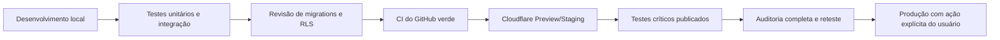

# Ambientes, GitHub e Deploy — VK ORGANIZAÇÃO

**Situação atual:** nenhuma integração externa foi configurada e nenhuma publicação foi iniciada. Esta é uma medida intencional de segurança e segue o gate de qualidade da especificação-mãe.

## Integrações previstas

| Serviço | Função | Estado | Necessidade de autorização |
|---|---|---|---|
| GitHub | Repositório privado, pull requests, CI e histórico de migrations. | A CONFIGURAR | Nenhuma para criar o repositório privado na conta conectada; confirmação para qualquer ação sensível adicional. |
| Supabase | Auth, PostgreSQL, RLS, Storage e Realtime. | A CONFIGURAR | Login, projeto ou token de acesso da conta do usuário. |
| Cloudflare | Worker, Static Assets, Turnstile, preview e produção. | A CONFIGURAR | Login, conta/zona e token ou autorização correspondente. |

## Fluxo de entrega obrigatório

O deploy é bloqueado se lint, typecheck, unit tests, integration/RLS tests, testes E2E críticos ou build falharem. A URL de preview não é produção: nela serão repetidos login, rotas, Worker, Supabase, RLS, Realtime, API Free Fire, Storage, PWA e redirects. O deploy de produção exige que os itens críticos estejam `APROVADO` no checklist e que não haja correção pendente.

## Configuração versionada

O repositório conterá código, `supabase/migrations`, testes, documentação, manifestos e templates seguros de ambiente. Nunca conterá secrets ou dumps de dados. As variáveis reais são cadastradas como secrets no GitHub, Supabase ou Cloudflare, com escopo mínimo e rotação quando necessário. `FREEFIRE_API_KEY` não será logada, entregue ao cliente ou incluída em arquivo versionado.

## Intervenções inevitáveis

Quando o login, 2FA, CAPTCHA, aceite de termos ou autorização de um provedor for necessário, a instrução ao usuário deverá informar o site, botão/ação, objetivo, o que não compartilhar e a próxima etapa automática. Senhas, tokens, códigos 2FA e chaves privadas jamais devem ser enviados pelo chat ou inseridos em arquivos públicos.

## Plano de reversão

Cada preview e produção utilizam versão rastreável. Migrations destrutivas exigem backup/plano específico, revisão e estratégia de rollback. O rollback de código não é tratado como rollback automático de dados; alterações de schema devem ser compatíveis ou ter migration corretiva documentada.

## GitHub privado

O repositório remoto privado da implementação está em [github.com/vendercontaff2024-wq/vk-organizacao](https://github.com/vendercontaff2024-wq/vk-organizacao). O estado atual foi versionado no commit `8fd77d82d578f2c5362edd4a52414dddd0f4e7a2` e confirmado no branch `main`. A árvore local está limpa. A inspeção de nomes versionados encontrou apenas código de ambiente e documentação de configuração; valores de secrets não são armazenados no repositório.

A publicação da aplicação permanece separada deste versionamento e continua bloqueada até os gates funcionais, de Realtime, acessibilidade, desempenho e comparação final com a especificação-mãe.
